# Design Document - Portal Big Data

## Overview

O Portal Big Data será uma plataforma web moderna e abrangente que serve como hub central para profissionais de Big Data. O design segue uma arquitetura dual que divide claramente o portal em duas jornadas distintas: "Entrar no Hadoop" para iniciantes e adotantes, e "Sair do Hadoop" para profissionais buscando alternativas modernas.

A plataforma utilizará Bootstrap 5.3 como framework base, implementará um tema visual inspirado no Matrix, e fornecerá páginas individuais detalhadas para mais de 50 tecnologias de Big Data, incluindo as mais relevantes de 2024/2025.

## Architecture

### High-Level Architecture

```mermaid
graph TB
    A[Landing Page Matrix Theme] --> B[Pílula Vermelha - Entrar no Hadoop]
    A --> C[Pílula Azul - Sair do Hadoop]
    
    B --> D[Hadoop Basics]
    B --> E[Distribuições Hadoop]
    B --> F[Cursos Iniciantes]
    B --> G[Casos de Uso]
    
    C --> H[Alternativas Modernas]
    C --> I[Guias de Migração]
    C --> J[Stacks Open-Source]
    C --> K[Comparações Técnicas]
    
    L[Catálogo de Tecnologias] --> M[50+ Páginas Individuais]
    N[Sistema de Cursos] --> O[15+ Cursos Especializados]
    P[Conteúdo Patrocinado] --> Q[Artigos e Banners]
    R[Blog e Recursos] --> S[Tutoriais e Novidades]
```



### Technology Stack

- **Frontend Framework**: Bootstrap 5.3
- **Theme**: Matrix-inspired (dark background, green text, Courier font)
- **Responsive Design**: Mobile-first approach
- **Performance**: Optimized loading, image compression
- **SEO**: Semantic HTML, meta tags, structured data
- **Compatibility**: Bootstrap Studio compatible

### Site Structure

```
hadoop.com.br/
├── index.html (Matrix Landing Page)
├── entrar-hadoop/ (Pílula Vermelha)
│   ├── introducao/
│   ├── distribuicoes/
│   ├── primeiros-passos/
│   └── casos-uso/
├── sair-hadoop/ (Pílula Azul)
│   ├── alternativas/
│   ├── migracao/
│   ├── comparacoes/
│   └── stacks-modernas/
├── tecnologias/ (50+ páginas individuais)
│   ├── sistemas-arquivos/
│   ├── processamento/
│   ├── data-warehousing/
│   ├── streaming/
│   ├── machine-learning/
│   ├── orquestracao/
│   └── visualizacao/
├── cursos/
├── blog/
├── patrocinadores/
└── contato/
```

## Components and Interfaces

### 1. Landing Page Matrix Interface

**Component**: Matrix-themed homepage with dual navigation
**Purpose**: Provide immersive entry point with clear path selection

**Key Elements**:
- Matrix rain animation background (CSS-only)
- Two prominent CTA buttons styled as pills
- Responsive hero section
- Partner banner integration
- Newsletter signup

**Bootstrap Components Used**:
- `navbar` for main navigation
- `hero` section with `container-fluid`
- `btn` classes for pill buttons
- `row`/`col` grid for banners

### 2. Dual Navigation System

**Component**: Contextual navigation for each area
**Purpose**: Maintain clear separation between "Entrar" and "Sair" journeys

**Entrar no Hadoop Navigation**:
```html
<nav class="navbar navbar-expand-lg navbar-dark bg-success">
  <div class="container">
    <a class="navbar-brand text-success">🟢 Entrar no Hadoop</a>
    <ul class="navbar-nav">
      <li><a href="/entrar-hadoop/introducao">Introdução</a></li>
      <li><a href="/entrar-hadoop/distribuicoes">Distribuições</a></li>
      <li><a href="/entrar-hadoop/primeiros-passos">Primeiros Passos</a></li>
    </ul>
  </div>
</nav>
```

**Sair do Hadoop Navigation**:
```html
<nav class="navbar navbar-expand-lg navbar-dark bg-danger">
  <div class="container">
    <a class="navbar-brand text-danger">🔴 Sair do Hadoop</a>
    <ul class="navbar-nav">
      <li><a href="/sair-hadoop/alternativas">Alternativas</a></li>
      <li><a href="/sair-hadoop/migracao">Migração</a></li>
      <li><a href="/sair-hadoop/stacks-modernas">Stacks Modernas</a></li>
    </ul>
  </div>
</nav>
```

### 3. Technology Pages Template

**Component**: Standardized template for 50+ technology pages
**Purpose**: Consistent presentation of detailed technology information

**Template Structure**:
```html
<div class="container technology-page">
  <div class="row">
    <div class="col-md-8">
      <div class="tech-header">
        
        <h1>Technology Name</h1>
        <div class="tech-badges">
          <span class="badge bg-primary">Open Source</span>
          <span class="badge bg-success">2024 Trending</span>
        </div>
      </div>
      
      <div class="tech-content">
        <section class="overview">...</section>
        <section class="features">...</section>
        <section class="use-cases">...</section>
        <section class="examples">...</section>
      </div>
    </div>
    
    <div class="col-md-4">
      <div class="tech-sidebar">
        <div class="quick-facts">...</div>
        <div class="related-technologies">...</div>
        <div class="official-links">...</div>
      </div>
    </div>
  </div>
</div>
```

### 4. Course Platform Interface

**Component**: Course listing and detail pages
**Purpose**: Organize and present 15+ specialized courses

**Course Card Component**:
```html
<div class="card course-card">
  <div class="card-header">
    <h5>Course Title</h5>
    <span class="badge bg-info">Intermediate</span>
  </div>
  <div class="card-body">
    <p class="card-text">Course description...</p>
    <div class="course-meta">
      <small>Duration: 40h | Prerequisites: Basic SQL</small>
    </div>
  </div>
  <div class="card-footer">
    <a href="#" class="btn btn-primary">Inscrever-se</a>
    <a href="#" class="btn btn-outline-secondary">Mais Info</a>
  </div>
</div>
```

### 5. Sponsored Content System

**Component**: Clearly marked sponsored content areas
**Purpose**: Integrate partner content while maintaining transparency

**Sponsored Article Template**:
```html
<article class="sponsored-content">
  <div class="sponsored-label">
    <span class="badge bg-warning">Conteúdo Patrocinado</span>
  </div>
  <div class="content">
    <!-- Article content -->
  </div>
  <div class="sponsor-info">
    <small>Patrocinado por: <a href="#">Partner Name</a></small>
  </div>
</article>
```

## Data Models

### Technology Data Model

```javascript
{
  id: "apache-spark",
  name: "Apache Spark",
  category: "processamento",
  logo: "/images/logos/spark-logo.png",
  officialSite: "https://spark.apache.org",
  github: "https://github.com/apache/spark",
  description: "Unified analytics engine for large-scale data processing",
  features: [
    "In-memory processing",
    "Multi-language support",
    "Streaming capabilities",
    "Machine learning library"
  ],
  useCases: [
    "ETL processing",
    "Real-time analytics",
    "Machine learning pipelines"
  ],
  alternatives: ["apache-flink", "apache-storm"],
  trending: true,
  lastUpdated: "2024-12-01",
  version: "3.5.0",
  license: "Apache 2.0",
  documentation: "https://spark.apache.org/docs/latest/",
  tutorials: [
    {
      title: "Getting Started with Spark",
      url: "/tutorials/spark-getting-started",
      level: "beginner"
    }
  ]
}
```

### Course Data Model

```javascript
{
  id: "apache-spark-fundamentals",
  title: "Apache Spark Fundamentals",
  description: "Complete guide to Apache Spark for data processing",
  category: "processamento",
  level: "intermediate",
  duration: "40 hours",
  prerequisites: ["Basic Python", "SQL knowledge"],
  technologies: ["apache-spark", "python", "sql"],
  modules: [
    {
      title: "Introduction to Spark",
      duration: "4 hours",
      topics: ["RDDs", "DataFrames", "Spark SQL"]
    }
  ],
  instructor: "Expert Name",
  price: "free",
  enrollmentUrl: "https://partner.com/course",
  featured: true
}
```

### Hadoop Distribution Data Model

```javascript
{
  id: "cloudera-data-platform",
  name: "Cloudera Data Platform",
  type: "commercial",
  description: "Enterprise data cloud platform",
  components: [
    "HDFS", "YARN", "Hive", "Impala", "Spark", "Kafka"
  ],
  targetAudience: "enterprise",
  pricing: "contact-sales",
  supportLevel: "enterprise",
  cloudSupport: ["AWS", "Azure", "GCP"],
  onPremise: true,
  documentation: "https://docs.cloudera.com",
  trialAvailable: true,
  lastUpdate: "2024-11-01"
}
```

## Error Handling

### Client-Side Error Handling

**404 Page Not Found**:
- Custom Matrix-themed 404 page
- Suggestions for similar content
- Search functionality
- Navigation back to main areas

**Broken Links**:
- Automatic link checking system
- Fallback content for unavailable resources
- User reporting mechanism

**Performance Issues**:
- Loading states for slow connections
- Progressive image loading
- Graceful degradation for older browsers

### Content Management

**Missing Technology Information**:
- Placeholder content with "Coming Soon" status
- User contribution system for missing information
- Regular content audits and updates

**Outdated Information**:
- Last updated timestamps on all pages
- Version tracking for technologies
- Automated alerts for major version releases

## Testing Strategy

### Unit Testing

**Component Testing**:
- Bootstrap component functionality
- Responsive behavior across devices
- Cross-browser compatibility
- Accessibility compliance (WCAG 2.1)

**Content Testing**:
- Link validation
- Image optimization verification
- SEO meta tag validation
- Performance metrics

### Integration Testing

**Navigation Flow Testing**:
- Dual navigation system functionality
- Search and filter operations
- Course enrollment process
- Sponsored content display

**User Journey Testing**:
- "Entrar no Hadoop" complete flow
- "Sair do Hadoop" complete flow
- Technology discovery process
- Course selection and enrollment

### Performance Testing

**Load Testing**:
- Page load times under 3 seconds
- Image optimization effectiveness
- CDN performance
- Mobile performance metrics

**SEO Testing**:
- Search engine indexing
- Meta tag optimization
- Structured data validation
- Mobile-friendly testing

### Content Quality Testing

**Technology Pages**:
- Information accuracy verification
- Logo and branding compliance
- Link functionality
- Content freshness validation

**Course Information**:
- Enrollment link functionality
- Prerequisite accuracy
- Content level appropriateness
- Instructor information validation

## Modern Technologies 2024/2025 Research Integration

### Trending Technologies to Highlight

**Data Lakehouse Platforms**:
- Databricks Lakehouse Platform
- Snowflake Data Cloud
- Delta Lake with Unity Catalog
- Apache Iceberg with Tabular

**Real-time Analytics**:
- Apache Pinot
- ClickHouse Cloud
- StarRocks
- Apache Druid

**Data Orchestration**:
- Prefect 2.0
- Dagster Cloud
- Apache Airflow 2.8+
- Temporal

**Cloud-Native Solutions**:
- Kubernetes-native data processing
- Serverless analytics (AWS Glue, Google Dataflow)
- Container-based ML platforms
- Edge computing for IoT data

### Hadoop Distributions Deep Dive

**Enterprise Distributions**:
1. **Cloudera Data Platform (CDP)**
   - Hybrid cloud architecture
   - Integrated security and governance
   - Machine learning capabilities
   - Multi-cloud support

2. **Amazon EMR**
   - Serverless EMR
   - EMR on EKS
   - Cost optimization features
   - Integration with AWS services

3. **Google Cloud Dataproc**
   - Serverless Spark and Hadoop
   - Auto-scaling capabilities
   - Integration with BigQuery
   - Preemptible instances support

4. **Microsoft Azure HDInsight**
   - Integration with Azure ecosystem
   - Enterprise security features
   - Support for multiple frameworks
   - Cost management tools

**Open Source Distributions**:
1. **Apache Bigtop**
   - Community-driven packaging
   - Multi-platform support
   - Continuous integration
   - Vendor-neutral approach

2. **Clemlab OpenSource Data Platform**
   - 100% open source
   - Apache Ambari management
   - Latest component versions
   - Community support

**Specialized Distributions**:
1. **Acceldata Open Data Platform**
   - Observability-focused
   - Performance optimization
   - Cost management
   - Multi-cloud deployment

## SEO Strategy and Implementation

### Meta Tags Template for Technology Pages

```html
<head>
  <!-- Primary Meta Tags -->
  <title>Apache Spark - Processamento Distribuído | Portal Big Data</title>
  <meta name="title" content="Apache Spark - Processamento Distribuído | Portal Big Data">
  <meta name="description" content="Guia completo do Apache Spark: instalação, configuração, casos de uso e comparações. Aprenda processamento distribuído em memória para Big Data.">
  <meta name="keywords" content="apache spark, big data, processamento distribuído, hadoop alternativa, analytics">
  
  <!-- Open Graph / Facebook -->
  <meta property="og:type" content="article">
  <meta property="og:url" content="https://hadoop.com.br/tecnologias/processamento/apache-spark">
  <meta property="og:title" content="Apache Spark - Processamento Distribuído | Portal Big Data">
  <meta property="og:description" content="Guia completo do Apache Spark: instalação, configuração, casos de uso e comparações.">
  <meta property="og:image" content="https://hadoop.com.br/images/og/apache-spark-og.jpg">
  
  <!-- Twitter -->
  <meta property="twitter:card" content="summary_large_image">
  <meta property="twitter:url" content="https://hadoop.com.br/tecnologias/processamento/apache-spark">
  <meta property="twitter:title" content="Apache Spark - Processamento Distribuído | Portal Big Data">
  <meta property="twitter:description" content="Guia completo do Apache Spark: instalação, configuração, casos de uso e comparações.">
  <meta property="twitter:image" content="https://hadoop.com.br/images/twitter/apache-spark-twitter.jpg">
  
  <!-- Structured Data -->
  <script type="application/ld+json">
  {
    "@context": "https://schema.org",
    "@type": "SoftwareApplication",
    "name": "Apache Spark",
    "description": "Unified analytics engine for large-scale data processing",
    "url": "https://spark.apache.org",
    "applicationCategory": "Data Processing",
    "operatingSystem": "Linux, Windows, macOS",
    "offers": {
      "@type": "Offer",
      "price": "0",
      "priceCurrency": "USD"
    }
  }
  </script>
</head>
```

### URL Structure for SEO

```
hadoop.com.br/
├── tecnologias/
│   ├── sistemas-arquivos/
│   │   ├── hdfs/
│   │   ├── minio/
│   │   └── delta-lake/
│   ├── processamento/
│   │   ├── apache-spark/
│   │   ├── apache-flink/
│   │   └── apache-beam/
│   ├── data-warehousing/
│   │   ├── apache-hive/
│   │   ├── clickhouse/
│   │   └── snowflake/
│   └── streaming/
│       ├── apache-kafka/
│       ├── apache-pulsar/
│       └── amazon-kinesis/
├── cursos/
│   ├── apache-spark-fundamentals/
│   ├── delta-lake-essentials/
│   └── hadoop-migration-guide/
├── entrar-hadoop/
│   ├── introducao-hadoop/
│   ├── distribuicoes-hadoop/
│   └── primeiros-passos-hadoop/
└── sair-hadoop/
    ├── alternativas-hadoop/
    ├── migracao-hadoop/
    └── stacks-modernas/
```

### Internal Linking Strategy

**Technology Cross-References**:
- Link related technologies within content
- "Alternatives" section with internal links
- "Complementary tools" suggestions
- Category-based navigation

**Content Hierarchy**:
- Breadcrumb navigation for all pages
- Category landing pages
- Topic clusters around main technologies
- Hub pages for major concepts

### Content Optimization Guidelines

**Keyword Strategy**:
- Primary keywords: "hadoop", "big data", "apache spark", "data processing"
- Long-tail keywords: "hadoop alternatives 2025", "apache spark vs flink", "big data migration guide"
- Local keywords: "big data brasil", "hadoop curso português"

**Content Structure**:
- H1 tag for main technology name
- H2 tags for major sections (Overview, Features, Use Cases)
- H3 tags for subsections
- Proper heading hierarchy throughout

## Implementation Phases

### Phase 1: Core Infrastructure & SEO Foundation
- Bootstrap 5.3 setup with semantic HTML5
- Matrix theme implementation
- Dual navigation system
- SEO-optimized page templates
- Meta tags and structured data implementation

### Phase 2: Content Management & SEO Tools
- Technology page templates with SEO optimization
- Content management system
- Logo and asset management with alt tags
- XML sitemap generation
- Robots.txt configuration

### Phase 3: Advanced Features & Performance
- Search functionality with SEO-friendly URLs
- Course platform with structured data
- Sponsored content system with proper markup
- Performance optimization for Core Web Vitals
- Image optimization and lazy loading

### Phase 4: Content Population & SEO Monitoring
- 50+ technology pages with optimized content
- 15+ course descriptions with structured data
- Blog content with SEO best practices
- Partner integration with proper attribution
- SEO monitoring and analytics setup

### SEO Monitoring and Maintenance

**Tools Integration**:
- Google Search Console setup
- Google Analytics 4 implementation
- Core Web Vitals monitoring
- Structured data testing tool
- Mobile-friendly test integration

**Regular SEO Tasks**:
- Monthly keyword ranking monitoring
- Quarterly content freshness review
- Annual SEO audit and optimization
- Continuous performance monitoring
- Link building and outreach campaigns

This comprehensive design provides a solid foundation for building a modern, SEO-optimized Big Data portal that will rank well in search engines while serving both newcomers to Hadoop and professionals seeking alternatives, maintaining excellent user experience across all devices.